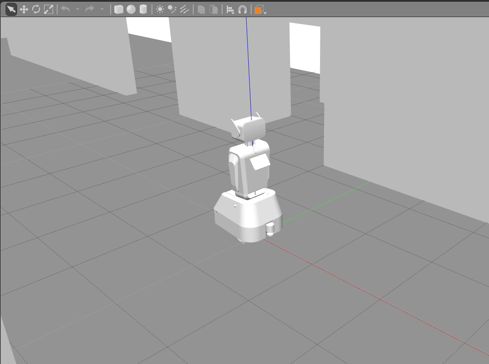
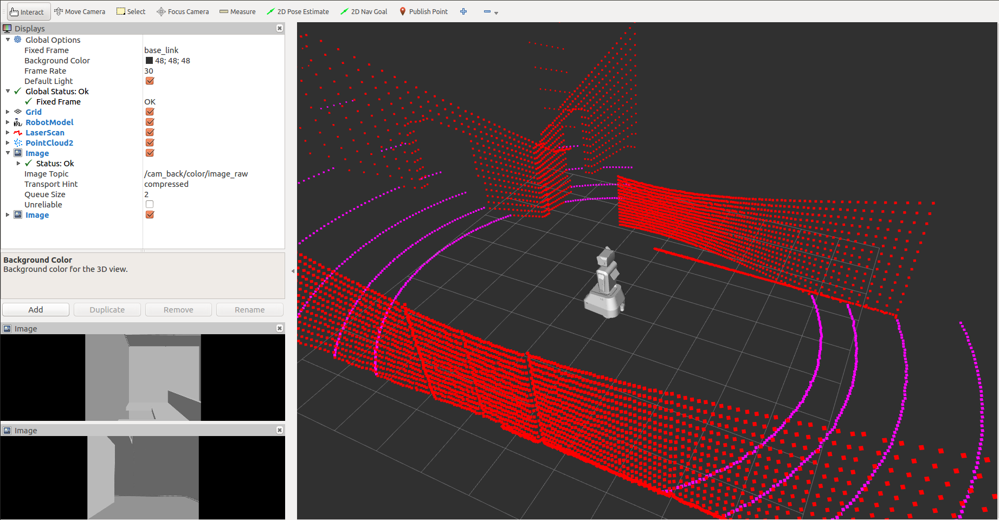

# **cmr_gazebo**: Gazebo simulation
This package contains worlds and launch files to run the robot in simulation

## How to use
For Gazebo to find the models, the path variable must be set in the .bashrc.
```
echo "export GAZEBO_MODEL_PATH=\"\$(rospack find cmr_gazebo)/worlds/models\":\$GAZEBO_MODEL_PATH" >> ~/.bashrc
```
You may need to download gazebo models
```
mkdir ~/.gazebo/models
git clone https://github.com/osrf/gazebo_models.git ~/.gazebo/models/
```

You can start the simulation via:
```
roslaunch cmr_gazebo simulation.launch
```



You can visualize some basic topics with an rviz config:
```
rviz -d $(rospack find cmr_gazebo)/rviz/sim.rviz
```


To move the robot in simulation, you can use the `teleop_twist_keyboard` package:
```
rosrun teleop_twist_keyboard teleop_twist_keyboard.py
```
The robot can then be moved using the keys (i, j, k, l).
